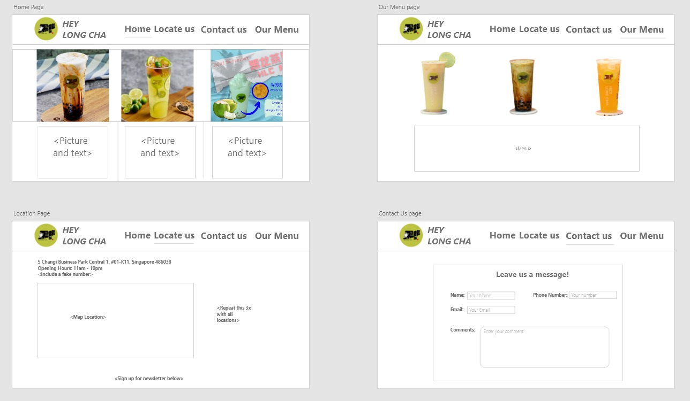

# ID-Assignment1
This Repository is for my assignment.

# Your Project's Name

My project was a website to promote a bubble tea shop named Hey Long Cha (HLC) and their brand. I made a website consisting of the following:
• Home
• Locate Us
• Contact Us
• Our Menu
In each of the pages, I added promotional materials. For example, my home page includes these promotional materials such as a slider menu where users can navigate through four different pictures which show our store's most popular drinks.
 
## Design Process
 
For the design process, I went for more of a light theme. I wanted to ensure that people who visit this page are greeted with a page that isn't too busy; I also wanted to make sure that they can direct their eyes to the first thing they see on their screen as soon as they open the website which is a slider of pictures of our most popular drinks.

This website was dedicated to my boss who I've been working for for almost 2 years now, I know him personally too which was mostly the main reason why I decided to make this website. When I told him that I was to make this website, he was very shocked and was supportive of this idea as we don't presently have a website for HLC. He didn't specifically ask me to design in any way so I went with what I thought would be good as a bubble tea store website.

From a user's perspective, the goal I had in mind was for them to get to know more about our store. The "Our Menu" page is there to let them know what we have for sale in our store and when they walk past it they can come and buy an item that intrigues them.

Here is my wireframe

## Features
Features that I have in my page include but aren't limited to:
• Image Sliders
• Animated Navigation Bar
• HLC Newsletter
• Back To top button
• Google Maps
• Contact Page
• Spotlight for drinks
• Hamburger navigation bar feature

### Existing Features
- Image Slider - When the user clicks a button in the image slider, they will be able to navigate through the pictures that are inside, if untouched, it will automatically scroll by itself.

- Functioning Newsletter (Unapplied!) - When the user fills up their information, they will be part of the HLC newsletter.

### Features Left to Implement
- Footers with information on our social media pages.

## Technologies Used

HTML - Used to show what happens in the front of the screen, essentially to display everything.

CSS - Used to format the codes that I have written in the HTML page.

JavaScript - Used to function different user activities.

## Testing

1. Play with the Image Slider
    - Keep pressing buttons
    - You may need to click twice if the timer resets as you click on a new button

2. Play around with the page dimensions
    - Try to find a dimension that fits you and look at its features. 

## Credits
- https://youtu.be/flItyHiDm7E (Hamburger Menu)
- https://youtu.be/0wvrlOyGlq0 (Image Slider)
- https://youtu.be/GU4sN7xxHkM (Responsive Form)
- https://youtu.be/KIC0OK9nKXY (Maps)
- https://www.w3schools.com/css/css3_flexbox_container.asp (Flexboxes)

### Content

### Media
- The photos used in this site were obtained directly from my boss who gave me access to images.
- https://www.facebook.com/heylongchasg/photos

### Acknowledgements

- I received inspiration for this project from other websites such as those below here:
- https://bobertea.sg/
- https://www.koithe.com/en
- https://royaltgroup.com/our-brands/liho.html
